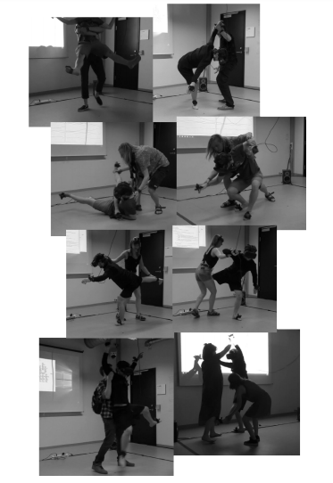

## Replication project choice ##
Banana keyboard 

## Related projects ##

### Related project 1 ###
The extended clarinet 
https://www.nime.org/proceedings/2016/nime2016_paper0034.pdf

This project relates on the basis of functionality and how the user interacts with the device. Both prioritise the inclusivity of the user in making the instrument work. the clarinets function relies on the user physically playing the instrument to send signals to the attachment created (the bell). This relates to the keyboard as we see this need for physical action to cause reaction in electrical sygnals. the augumented clarinet also focuses on maintaining the original form and way in which it is played, when comparing this to the banana keyboard it is evident that the pressing on the key motion maintains these aspects as well. this device uses a touch sensor technology to switch between differing modes, in the keyboard the same concept is used to send signals to the microbit and speaker. 

### Related project 2 ###
Sibilim
https://www.nime.org/proceedings/2019/nime2019_paper004.pdf

The sibilim is also an approach to the keyboard in a differing form. it demonstrates how light sensors may be used in place of touch sensors. Both the banana keyboard and sibilim focus on recreating the experience of a standard keyboard in a more technologicaly interactive way. This device uses a carboard frame as a lowcost effective approach, this may be used when creating the final project of the banana keyboard. the flow of this circuit works in a similar way as well , showing thisinteraction from user to key to phone/microbit. 

### Related project 3 ###
Otamatone 

https://otamatone.com/about-otamatone/

when looking at the circuit functionality of both devices they are very similar, as both require two hands to opperate them. this is evident because the user completes the transmission of the electric current from one point of the deivce to another. The code of both projects tells us that once the user touches a certain point or 'pin' that it must produce a sound at a particular tone. 

### Related project 4 ###
The sponge

http://www.martinmarier.com/wp/?page_id=12

This project is related to mine because it is largely based on the use if touch sensors. when looking at how the internals of this device are set up it is very similar to that of the banana keyboard, however instead of fruit this device uses different, much smaller attachment to send signals back to a recievior. from this the way in which the sponge is touched dictates what types of sounds are produced. this is further a more complex approach to the banana keyboard concept, however it is noted that the use of an accelerator could be implimented into the future design. 

### Related project 5 ###
touch keys

https://www.nime.org/proceedings/2012/nime2012_195.pdf

Touch keys are a much more advanced approach to augumenting the standard keyboard. the functionality of this device in essence is alike that of the banana keyboard, however this approach allows the user to do much more then press a key and have it play a single sound. this invention allows the user to change the pitch and tone of the note being played by sliding and performing other actions across the keys. it is likely that the basic components of coding for both would be similar, as both recieve a signal via touch and then transmit it to a receptor which performs the action of sound making. 

### Related project 6 ###
Somacoustics

https://www.nime.org/proceedings/2019/nime2019_paper019.pdf

This device relates to my chosen project as it focuses on the importance of the users role within the function of the insturment. without the users movement the instrument will not work. the banana keyboard requires that the user is touching 2 points of the circuit at all times to complete the circuit itself. The somacoustic requires that the user wear the intrument and move to cause the functions to work. In a sense it is as if the somacoustic makes the user a key. 

## Reading reflections ##
*Reflective reading is an important part of actually making your reading worthwhile. Don't just read the words to understand what they say: read to see how the ideas in the text fit with and potentially change your existing knowledge and maybe even conceptual frameworks. We assume you can basically figure out what the readings mean, but the more important process is to understand how that changes what you think, particularly in the context of your project.*

*For each of the assigned readings, answer the questions below.*

### Reading: Don Norman, The Design of Everyday Things, Chapter 1 (The Psychopathology of Everyday Things) ###

*What I thought before: 
It was npot recognised that theire is a distinction between affordances and signifiers, i always percieved them as the same thing. An affordance determines what actions are possible , where as a signifier communicates where the action should take place. 

*What I learned: 
affordances express how an object may possibly interact with its environment and poeple, and these can be percieved or not. with this in mind it is noted that a percieved affordance may actually be a misleading signifier, if done on purpose these are often to keep those who don't knwo about them from doing something/ interacting with the object. signifiers dictate possible actions and how to perform them. because of this a signifier must be percievable or else it wont work. 

*What I would like to know more about: 
"how do signifiers and affordances work in altering enviornments, and how does this effect human interaction with the environment?"

*How this relates to the project I am working on: 
the reading helps to understand what is required for a device to be successfully comprehended by the user. this may mean that certain symbols should be implemented in the final design of the project. 

### Reading: Chapter 1 of Dan Saffer, Microinteractions: Designing with Details, Chapter 1 ###

*What I thought before: 
when just reading the title i predicted that microinteractions reffered to subjects such as codes and electrical setups. it is clear now that it in fact means the smaller interactions the user has with the device and the parts which makeup the function of it. 

*What I learned: 
a higher quality product will always pay extra attention to the micro interactions of the final product. this is as they make for a more complete and cohesive end product. "less means more" -it is better to have a more simplistic micro interaction as to not lose the user or disturb the products functionality. 

*What I would like to know more about: 
I would like to know more about the individual aspects of the steps of micro interactions, being the trigger, rukles feedback and loops and modes. 

*How this relates to the project I am working on: 
This reading highlights the importance of making the microinteractions of the project simplistic and easy to comprehend. potentially through symbols or other indicators. 

### Reading: Scott Sullivan, Prototyping Interactive Objects ###

*What I thought before: 
i did not realise the lengthof time and effort that goes into making projects. there is much trial and error involved and it takes a lot of experimenting to get to an end produdct. 

*What I learned: 
with persistance anyone can learn how to code it just takes time and effort ot build skills. you have to experiment ot advance your projects and find what works best. As generations advance and grow up with technology thier is a wider understanding of how electronic devices operate from a younger age as well as being more tools and materials readily available. 

*What I would like to know more about: 
I would like to look into processing with aurduino as i to am a visual learner. 

*How this relates to the project I am working on:
This reading helps to understand ways to approach the design process for this project, potentailly tools i could use and how coding can be learnt with practice. experimenting and finding the appropriate actions to take also seems of importancnce and iw ill consider this when adapting the banana keyboard. 

## Interaction flowchart ##
*Draw a flowchart of the interaction process in your project. 

## Process documentation

This is a complete translation of the assigned 'banana keyboard' project, from this it was evident that the user became apart of the circuit and thus transfered the electirc current from the orange to the banana. In doing so code was given to make this interaction cause a tone to sound. To operate this action it is required that one hand touches the orange at all times, this is as the orange is connected via alligator clips to the ground source of the micro;bit. 
 
Below shows a rough diagram of the connections between the elements of the circuit; 

Considerations from this intial project;
- how can I elaberate on or change the existing elements?
- adding another key 
-converting earphones to sepaker
-creating sound from other sources 
-display lights 

To utelize the spare pin 2 I connected another fruit to form another key tone, the following code was used 
  
  

It is evident that both keys give differing effects, ones tone increases while the other decreases to create contrast 

By adding a speaker the project becomes much more inclusive of others to interact rather than just an individual expierence, this simply meant taking the alligator clips and unclipping them from the earphones, thus substituting the speaker in place

wanting to increase the complexity of the project i attempted adding yet another key. however on several attempts of altering code and checking the wire connections, this attempt did not follow through. when adding the key to pin 0 it will only play the key before the other keys are pressed, once a key on pin 1 or 2 is played you cannot play pin 0 again.

utelizing buttons A and B as substitues for keys i could not create using the aligator clips and pins, to add more sounds and thus create more of a keyboard concept. to identify these notes the LED screen displays lights arrange in the letter of the note played.

these are the codes used; 

due to the perishable nature of fruit i decided to change the keys into pieces of alfoil, this is as alfoil works as an excellent conductor of electricity, later on in the final presentation the use of alfoil will be more tidy. 

i tried another approach to adding more keys through the use of a breadboard. to do this i located a source online 'https://www.youtube.com/watch?v=ulKq5To9dmA' to assist with the coding and assembly of this project. however, i had to substitute certain wires as i did not have them and removed 2 keys in order to do so. As a result the piano would not play past the keys attached to pins 1 and 2. from this I gathered that the resistors may have not been the required type or that some step in this process went wrong. this is also why i decided to revert back to the original design as pins 1 and 2 where all that was required. 

In attempting to fix the resistor problem i removed them all together, however this made the keys play by themselves as there are no signials indicating when the keys should stop or start playing. although this was an interesting concept it removed the element of interaction between user and device, therefore i moved on from this concept. 

reverting back to original concept design
for pins 1 and 2 i decided to add corresponding light signals to indicate when the sound is high or when it is low.

code

Buttons A and B now become back tracks so that the key notes can be layered 

To increase sound i further looked into the guitar on the microbit page and located the use of acceleration, from this I coded the micro;bit to play notes when tilted left or right. This was done becuase I did not want to eliminate the sounds from buttons A and B. 
Guitar code;

Tilting code for acceleration 

## Project outcome ##

link to video presentation https://youtu.be/aXNmyKd1xpY

### Banana JamBoard ###

### Project description ###

*In a few sentences, describe what the project is and does, who it is for, and a typical use case.*

### Showcase image ###

### Additional view ###

### Reflection ###

*Describe the parts of your project you felt were most successful and the parts that could have done with improvement, whether in terms of outcome, process, or understanding.*
I feel as though the most successful part of this project is the attainment of producing more then 2 tones of sound and providing differing ways to produce these sounds. I included an acceleration aspect via tilting the microbit to add 2 additional notes to the project, as well as added melodies as backtracks via the A and B buttons. Also adding the LED light symbols to create a distinction between the high and low sounds produced by pins 1 and 2 was also effective in creating cohesion between visuals and sound. i feel as though i could have improved upon the overall aesthtic elements, refinements could have been made with the use of differing materials such as plywood and copper tape. Also perhaps further research and investigation into the breadboard concepts explored may have lead me towards a more refined and substantial augmentation of the orginal device, however time restraints where at play. Also maybe more could have been done to highlight the micro-interactions of the project, such as the tilting left to right aspect, through the use of arrows or other symbols. 

*What techniques, approaches, skills, or information did you find useful from other sources (such as the related projects you identified earlier)?*
when wanting to develope more sounds i had to look for alternatives to producing more keys, this is when i reflected back on the use of acceleration as found in the earlier projects identified at the start of this assesment piece. i also kept in mind the improtance of interaction between user and device this is why i decided to keep the use of keys and otehr interactive elements when faced with the self playing piano made on the breadboard. 

*What ideas have you read, heard, or seen that informed your thinking on this project? (Provide references.)*
mostly the concepts for this assignment came from the related projects i analysed above. The otamatone gave me the concept of creating a mpre toy like apperance to the end product, from this i created a small double turntable shell that allows the user to hold with both hands comfortabley. the extended clarinet sparked the notion of using the LED lights available on the micro;bit and from this i combined the knowledge of signifiers and affordances to create arrow symbols which intidcate higher and lower tones. chapter 1 of micro-interactions made me reflect on the importance of maintaining simplicity and to not overcomplicate the project. from this i believe i created a device that was both simple to construct as a learner and to function as a user. 

*What might be an interesting extension of this project? In what other contexts might this project be used?*
this could be created on a larger scale where the user gets to walk over or interacte with the device at a much larger scale. this would further increase the importance of the user to device relationship. this project could be used in an educational way if the symbols were changed to note labels it could teach children how to hear for notes. 
